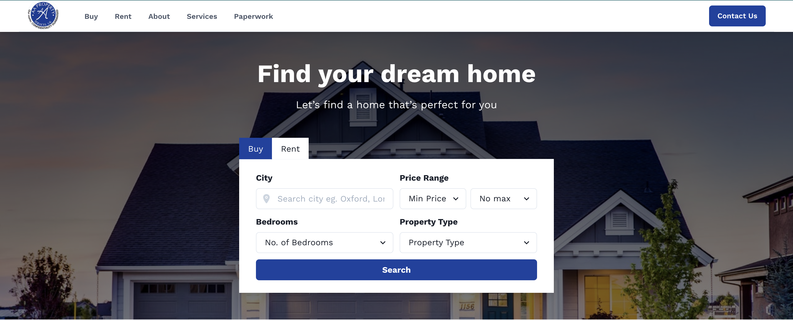
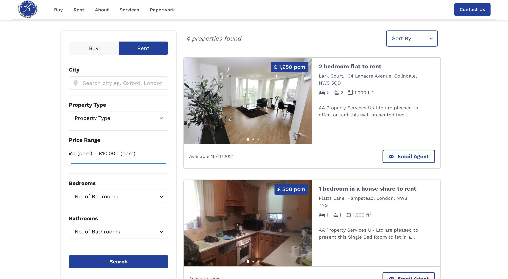
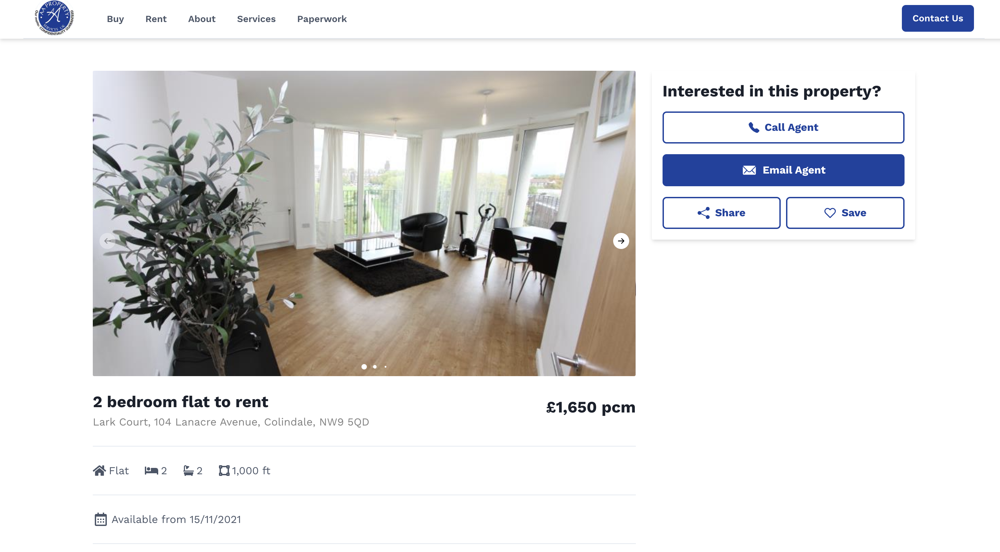
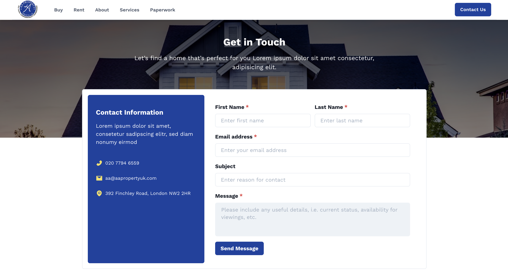

# AA Property Real Estate Website

- This is a client project focused on redesigning AA Property's current website as it is outdated and doesn't have the customer reach it needs. The website was made with Next.js and Supabase on the backend.

## Demo

[Demo](https://aaproperty.vercel.app/)






## Key Features

- Display list of properties available to buy and sell
- Filter properties based on purpose, min/max price, min no. of bedrooms, min no. of bathrooms, property type and location
- Sort functionality for properties
- Get Individual product details
- Able to send an email enquiring about specific properties
- Can view all services offered by the business
- Able to view all paperwork including terms of business, fees and compliance

## Getting Started

Clone the repository

```bash
git clone https://github.com/KelechiOdom10/aaproperty.git
```

Fill your .env variables:

```
NEXT_PUBLIC_SUPABASE_URL={YOUR SUPABASE URL}
NEXT_PUBLIC_SUPABASE_ANON_KEY={YOUR SUPABASE ANON KEY}
NEXT_PUBLIC_GOOGLE_MAPS_API_KEY={YOUR GOOGLE MAPS API KEY}
```

Install deps:

```bash
npm install
```

Run Next dev server:

```bash
npm run dev
```

## Nice to haves

- [ ] User authentication
- [ ] Ability to add properties to wishlist

## Contributing

This is an open source project, and contributions of any kind are welcome and appreciated. Open issues, bugs, and feature requests are all listed on the [issues](https://github.com/KelechiOdom10/aaproperty/issues) tab and labeled accordingly. Feel free to open bug tickets and make feature requests.
